<h1 align="center"> ALTRun</h1>

<p align="center">
  <b>轻量、高效、开源的 Windows 启动器, 操作习惯参照 macOS 上的 <a href="https://www.alfredapp.com/">Alfred</a></b><br>
  A lightweight, Alfred-style launcher for Windows, written in AutoHotkey v2
</p>

<p align="center">
  <a href="https://github.com/zhugecaomao/ALTRun/releases/latest"></a>
  <a href="https://github.com/zhugecaomao/ALTRun/releases"></a>
  <a href="https://www.autohotkey.com/"></a>
  
  <a href="LICENSE"></a>
</p>

<p align="center">
  <a href="#快速开始">快速开始</a> ·
  <a href="#特性">特性</a> ·
  <a href="#快捷键">快捷键</a> ·
  <a href="https://github.com/zhugecaomao/ALTRun/wiki">使用文档 (Wiki)</a> ·
  <a href="CHANGELOG.md">更新日志</a> ·
  <a href="#english">English</a>
</p>

<p align="center">
  
</p>


## 快速开始
1. 下载 [最新版本](https://github.com/zhugecaomao/ALTRun/releases/latest) 解压到任意文件夹; 或者安装 [AutoHotkey v2](https://www.autohotkey.com/) 后直接运行源码里的 `ALTRun.ahk`
2. 按 `Alt+Space` 呼出搜索窗口, 输入名称, `Enter` 打开
3. `Ctrl+,` 打开偏好设置, 修改热键、主题、索引范围等

绿色便携, 不写注册表: 设置保存在程序目录下的 `ALTRun.json`。

**用 [Scoop](https://scoop.sh/) 安装** (自动创建开始菜单快捷方式, 升级时保留设置):
```powershell
scoop bucket add altrun https://github.com/zhugecaomao/ALTRun
scoop install altrun
scoop update altrun    # 以后升级 (先退出 ALTRun)
```

**从旧版本升级**: 退出旧版本, 把新版本解压到原来的文件夹覆盖 `ALTRun.exe`, 再运行即可。第一次运行时自动导入旧的 `ALTRun.ini` (设置、自定义命令、热键), 原文件保持不变 (见 [安装与升级](https://github.com/zhugecaomao/ALTRun/wiki/Installation))。


## 特性
**搜索**
- **Alfred 式搜索窗口**: 输入即搜, 每行显示标题 + 路径/说明, 窗口高度随结果伸缩, 9 套内置主题
- **应用**: 自动索引开始菜单、桌面和应用商店应用; 中文名称支持拼音首字母 ("wx" → 微信); 不需要的应用按 `Ctrl+Del` 从结果中删除
- **文件和文件夹**: 和 Alfred 一样, 在空的搜索框里先按 `空格` 再输入名称 (或 `'报告` / `open 报告`); [Everything](https://www.voidtools.com/) 在运行时查询全盘, 否则使用内置索引 (桌面、文档、下载)
- **自定义命令**: 文件、文件夹、程序+参数、网址, 可设关键字; 也按目标的文件夹名 / 文件名匹配; 文件夹改名后可一键检查哪些命令的路径失效
- **学习排序**: 记住 "输入了什么 → 选了哪一项", 常用的自动靠前
- **使用统计**: 偏好设置里查看每天、每个功能用了多少次 (只记次数)
- **计算器**: 直接输入算式, 可选附带梁主筋 / 配筋面积的结构计算
- **网页搜索**: `g 关键词` (Google)、`bd 关键词` (百度) 等, 引擎可自行添加; 没有结果时给出兜底搜索
- **系统命令**: 锁屏、睡眠、关机、清空回收站、音量、Windows 工具、剪贴板文字转换 (大小写 / 排序 / 简繁转换...)

**效率**
- **操作面板**: 选中一项按 `→` 列出全部操作 (以管理员运行、显示位置、复制路径、在此打开终端、属性...), 右键也可以
- **在结果里直接编辑**: `F3` 修改命令 / 片段 / 搜索引擎, 应用和文件一键加为自定义命令
- **剪贴板历史**: `Ctrl+Alt+C` 或输入 `clip`, Enter 粘贴; 密码管理器复制的内容自动忽略
- **文字片段**: 支持 `{date}` `{clipboard}` `{cursor}` 等占位符; 在任何程序里输入 `;关键字` 自动展开
- **终端**: `>ipconfig /all` 直接在终端运行
- **大字显示**: `Ctrl+L` 全屏显示结果 (电话号码、计算结果...)

**扩展**
- **对话框快速跳转**: 打开 / 保存对话框里 `Ctrl+G` 跳到 Total Commander 当前目录, `Ctrl+E` 跳到资源管理器当前目录
- **Ctrl+D 加日期**: 重命名文件时在扩展名前加上日期
- **自定义热键**: 任意热键执行一条系统命令, 可限定在某个程序里生效
- **PT 工具箱**: 钢筋 / BRC 面积计算器、SPF2M 后张预应力束线型计算器 (直接计算, 结果可复制到 Excel)


## 截图
| 操作面板 (`→`) | 文件搜索 (`空格` + 名称) |
|:---:|:---:|
| 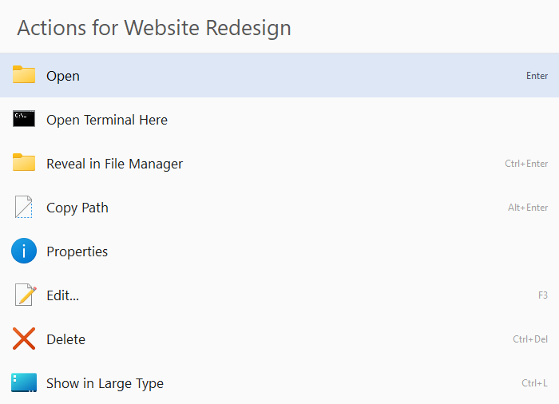 | 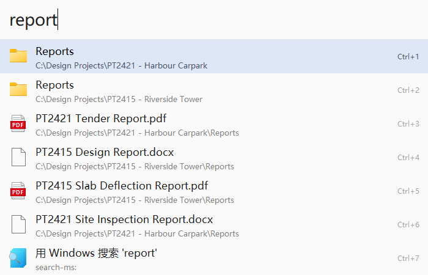 |
| **计算器 (附带结构计算)** | **剪贴板历史 (`clip`)** |
| 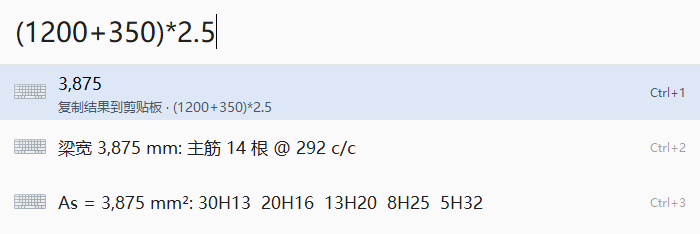 | 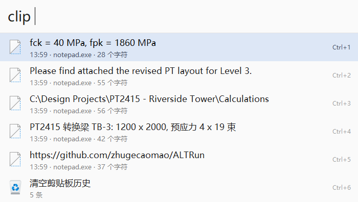 |
| **偏好设置** | **自定义命令** |
| 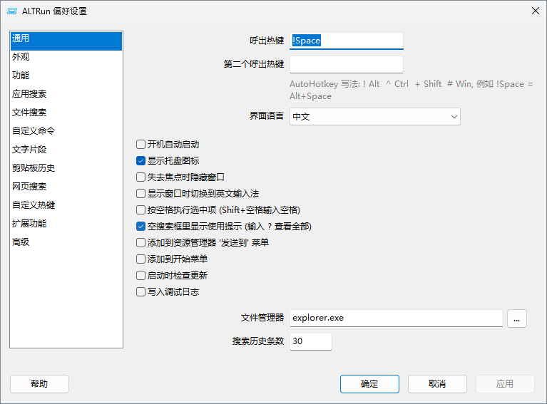 | 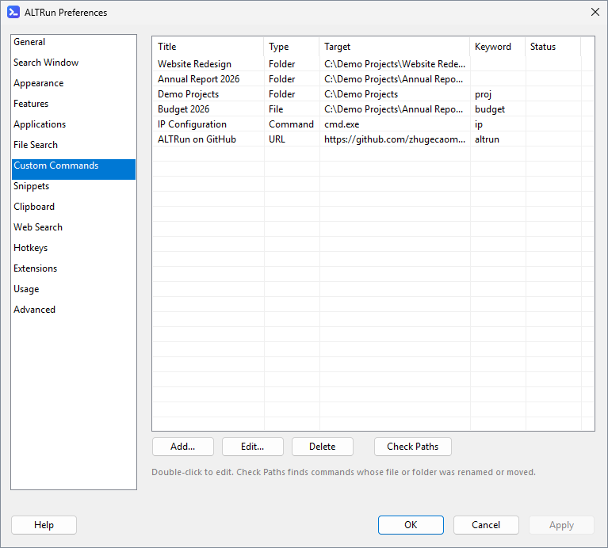 |

<details>
<summary><b>内置主题</b> (Dark / Classic / Midnight / Frost / Graphite / Ocean / Paper)</summary>

| Dark | Classic | Midnight |
|:---:|:---:|:---:|
| 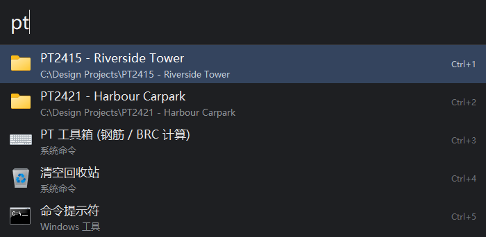 | 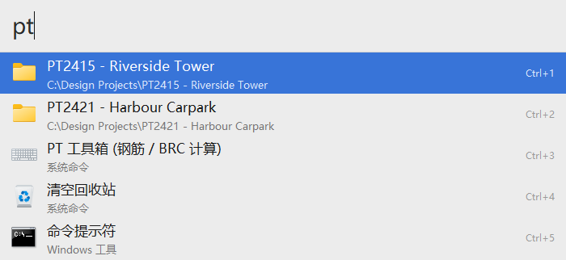 | 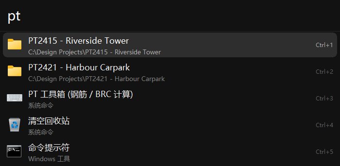 |
| **Frost** | **Graphite** | **Ocean** |
| 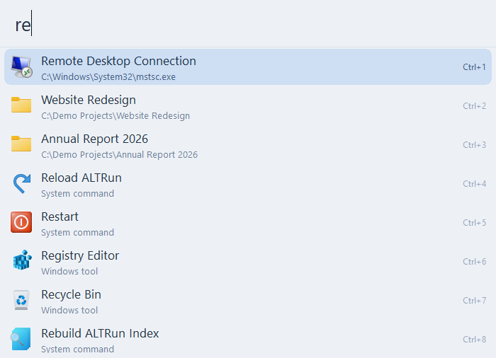 | 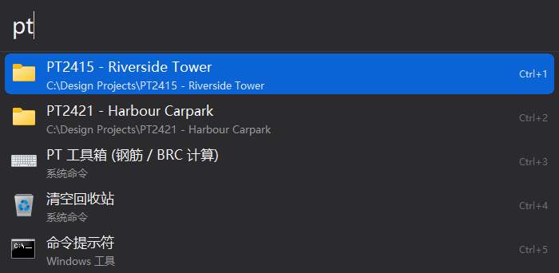 | 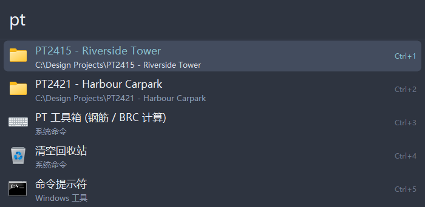 |
| **Paper** | | |
| 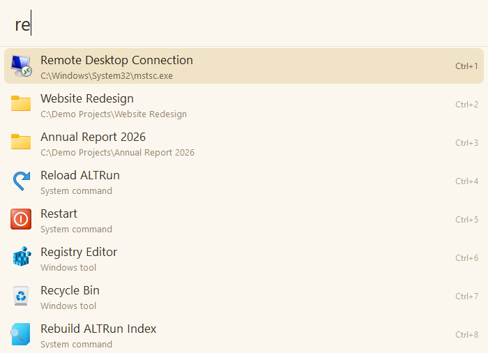 | | |

</details>

截图由 [Tests/Screenshots](Tests/Screenshots/TakeScreenshots.ahk) 在 GitHub Actions 的 Windows 机器上自动生成。


## 快捷键
| 按键 | 作用 |
|---|---|
| `Alt+Space` | 显示 / 隐藏搜索窗口 (可在设置里修改) |
| `Enter` | 执行选中项 |
| `Ctrl+Enter` | 文件 / 文件夹: 在文件管理器中显示; 文字: 粘贴到前台窗口 |
| `Alt+Enter` | 复制路径 / 网址 / 文字 |
| `Ctrl+1` ~ `Ctrl+9` | 直接执行第 N 行 |
| `↑` `↓` `PgUp` `PgDn` `Ctrl+P` `Ctrl+N` | 移动选择 |
| `Ctrl+↑` / `Ctrl+↓` | 上一条 / 下一条搜索记录 |
| `Tab` | 自动补全 |
| `空格` (搜索框为空时) | 进入文件搜索模式, 只搜文件和文件夹; `Backspace` 返回 |
| `folder 名称` | 只搜文件夹 |
| `?` | 速查表: 所有输入语法和快捷键 |
| `空格` (已输入文字) | 可选: 偏好设置 → 搜索窗口 打开 "按空格执行选中项" 后执行选中项, `Shift+空格` 输入空格 |
| `→` / 鼠标右键 | 操作面板 / 操作菜单 |
| `F3` | 编辑选中项; 应用、文件、网址: 添加为自定义命令; 没有结果时用输入的文字新建命令 |
| `Ctrl+Del` | 删除选中项 (删除前确认); 应用: 从搜索结果中删除, 可在偏好设置里恢复 |
| `Ctrl+C` / `Ctrl+L` | 复制选中项 / 大字显示 |
| `F2` 或 `Ctrl+,` / `F4` | 偏好设置 / 用记事本编辑 ALTRun.json |
| `Ctrl+Alt+C` | 剪贴板历史 |
| `Esc` | 关闭操作面板 / 隐藏窗口 |

完整的输入语法 (`'文件`、`>命令`、`clip`、`snip`、网页搜索关键字...) 见 Wiki: [搜索与快捷键](https://github.com/zhugecaomao/ALTRun/wiki/Usage)。


## 文档
使用文档都在 [Wiki](https://github.com/zhugecaomao/ALTRun/wiki):

| 页面 | 内容 |
|---|---|
| [安装与升级](https://github.com/zhugecaomao/ALTRun/wiki/Installation) | 下载、运行、开机启动、从 2.x 升级、卸载 |
| [搜索与快捷键](https://github.com/zhugecaomao/ALTRun/wiki/Usage) | 所有输入语法、快捷键、操作面板 |
| [自定义命令与片段](https://github.com/zhugecaomao/ALTRun/wiki/Commands-and-Snippets) | 命令类型、路径变量、片段占位符、自动展开 |
| [文件搜索](https://github.com/zhugecaomao/ALTRun/wiki/File-Search) | Everything 联动、内置索引、排除规则 |
| [主题](https://github.com/zhugecaomao/ALTRun/wiki/Themes) | 内置主题、自定义主题、全部可用的键 |
| [扩展功能](https://github.com/zhugecaomao/ALTRun/wiki/Extensions) | 对话框跳转、加日期、自定义热键、系统命令列表、PT 工具箱 |
| [设置文件参考](https://github.com/zhugecaomao/ALTRun/wiki/Configuration) | ALTRun.json 每一项的含义和默认值 |
| [常见问题](https://github.com/zhugecaomao/ALTRun/wiki/FAQ) | 热键冲突、搜不到、杀毒误报... |
| [开发指南](https://github.com/zhugecaomao/ALTRun/wiki/Development) | 架构、新增搜索功能、代码规范、测试 |


## 项目结构
```
ALTRun.ahk          入口: 列出所有模块并调用 App.Start()
Lib\                通用库, 与 ALTRun 无关 (JSON, Logger, Util, TextTools, Kanji, Dialogs, Everything IPC)
Src\Core\           启动流程, 设置与版本升级, 搜索模型, 匹配打分, 学习排序, 操作, 文件索引
Src\UI\             搜索窗口, 偏好设置窗口, 编辑对话框, 大字显示, 主题, 图标缓存
Src\Providers\      搜索功能: 应用 / 自定义命令 / 片段 / 剪贴板 / 系统命令 / 计算器 / 网页 / 文件 / 终端 / 速查表
Src\Extensions\     搜索窗口以外的功能: 片段自动展开, 对话框跳转, 加日期, PT 工具箱 (含 SPF2M 束线型计算), 检查更新
Resources\          随程序发布的数据 (Kanji.txt 简繁对照表, Themes\ 内置主题)
Tests\              单元测试, 对照数据 (Fixtures), 自动截图 (Screenshots), 生成 SPF2M 对照数据的 Python 工具 (Tools\SPF2M)
docs\               Wiki 源文件 (docs\wiki, 合并后自动发布), 截图 (docs\images)
bucket\             Scoop 清单 (仓库本身就是 Scoop bucket)
packaging\          winget 清单, 发布时更新清单的脚本
.github\            GitHub Actions (测试、截图、发布、Wiki), Issue / PR 模板
```

运行后程序目录下还会出现 `ALTRun.json` (设置)、`Data\` (索引和历史, 可以删除)、`Themes\` (你自己的主题)。升级时把新版本复制覆盖到程序目录即可。


## 开发
```
AutoHotkey64.exe /ErrorStdOut Tests\RunTests.ahk
```
单元测试不依赖界面, 退出码为失败的数量。新增搜索功能、代码规范和提交 PR 的流程见 [CONTRIBUTING.md](CONTRIBUTING.md) 和 Wiki 的 [开发指南](https://github.com/zhugecaomao/ALTRun/wiki/Development)。


## 贡献与反馈
- 发现问题: [提交 Issue](https://github.com/zhugecaomao/ALTRun/issues/new/choose) (请附上 Windows 版本和复现步骤)
- 想法和讨论: [Discussions](https://github.com/zhugecaomao/ALTRun/discussions)
- 提交代码: 请先阅读 [CONTRIBUTING.md](CONTRIBUTING.md)

如果 ALTRun 对你有帮助, 欢迎给它一个星标 ⭐


## English
ALTRun is a keyboard launcher for Windows modelled on Alfred for macOS. Press `Alt+Space`, type, press `Enter`.

- Finds apps (Start menu, desktop, Microsoft Store; pinyin initials for Chinese names), files and folders (through Everything when it is running, otherwise a built-in index), custom commands, snippets and system commands
- Learns which result you pick for each query, and ranks it first next time
- Action panel (`→` or right-click), in-place editing (`F3`), clipboard history, snippet auto-expansion, inline calculator, web search keywords, terminal commands, large type
- Nine built-in themes, plus custom themes as JSON files
- Portable: all settings live in `ALTRun.json` next to the program; older 2.x settings are converted automatically
- Install with Scoop: `scoop bucket add altrun https://github.com/zhugecaomao/ALTRun`, then `scoop install altrun`

The interface follows your Windows language (English or Chinese). Documentation is in the [Wiki](https://github.com/zhugecaomao/ALTRun/wiki) (Chinese). Issues and pull requests in English are welcome.


## 许可证与致谢
[GPL-3.0](LICENSE) © zhugecaomao

感谢 [ALTRun by etworker](https://github.com/etworker/ALTRun) (Delphi)、[RunZ by goreliu](https://github.com/goreliu/runz) (AutoHotkey), 以及 [Alfred](https://www.alfredapp.com/) 的设计; 对话框快速跳转借鉴了 [Listary](https://www.listary.com/) 的 Quick Switch。
