<h1 align="center"> ALTRun</h1>

<p align="center">
  <b>轻量、高效、开源的 Windows 启动器，操作方式参照 macOS 上的 <a href="https://www.alfredapp.com/">Alfred</a></b><br>
  按 <code>Alt+Space</code>，输入几个字母，按 <code>Enter</code>：程序、文件、网页、计算、剪贴板、系统命令，一个窗口完成<br>
  <sub>A lightweight, Alfred-style launcher for Windows, written in AutoHotkey v2</sub>
</p>

<p align="center">
  <a href="https://github.com/zhugecaomao/ALTRun/releases/latest"></a>
  <a href="https://github.com/zhugecaomao/ALTRun/releases"></a>
  <a href="https://www.autohotkey.com/"></a>
  
  <a href="LICENSE"></a>
</p>

<p align="center">
  <a href="https://zhugecaomao.github.io/ALTRun/">官网</a> ·
  <a href="#为什么选择-altrun">为什么选择</a> ·
  <a href="#快速开始">快速开始</a> ·
  <a href="#功能">功能</a> ·
  <a href="#快捷键">快捷键</a> ·
  <a href="https://github.com/zhugecaomao/ALTRun/wiki">使用文档 (Wiki)</a> ·
  <a href="CHANGELOG.md">更新日志</a> ·
  <a href="#english">English</a>
</p>

<p align="center">
  
</p>


## 为什么选择 ALTRun
- **小巧**：下载不到 1 MB，解压后约 2 MB，只有一个 `ALTRun.exe` 和少量资源文件，不需要安装 .NET、Electron 或其他运行库；同类启动器的安装包通常有几十 MB，安装后可达上百 MB。
- **快速响应**：输入第一个字符即显示结果；配合 [Everything](https://www.voidtools.com/) 毫秒级搜索全盘文件，未安装时使用内置索引。
- **智能排序**：根据使用习惯自动调整排名；支持单词首字母（`vsc` → Visual Studio Code）和拼音首字母（`wx` → 微信），并高亮匹配内容。
- **多合一**：计算与单位换算、网页搜索、浏览器书签、剪贴板历史、文字片段、系统命令、终端，无需再装多个小工具。
- **全键盘操作**：`→` 打开操作面板，`F3` 直接编辑，`Ctrl+1`～`Ctrl+9` 快速打开。
- **便携与隐私**：免安装，不写注册表，不需要管理员权限，没有后台服务或驱动；所有数据保存在 `Data\` 文件夹；不收集任何数据，仅联网检查和下载更新。
- **自动更新**：有新版本时在搜索窗口中提示，按 `Enter` 即可安装（自动校验 SHA256），设置保留；也支持 Scoop。
- **个性化**：简体中文、繁體中文、English、日本語界面；20 套内置主题（偏好设置里看缩略图选择），可跟随系统浅色 / 深色模式；主题和设置均为 JSON 文件。
- **开源免费**：GPL-3.0 许可；每个 PR 都会在 Windows 上自动运行 3000 余项测试。


## 快速开始
1. 下载[最新版本](https://github.com/zhugecaomao/ALTRun/releases/latest)，解压到任意文件夹，运行 `ALTRun.exe`（无需安装，也无需 AutoHotkey）。
2. 按 `Alt+Space`（或 `Alt+R`）打开搜索窗口，输入名称，按 `Enter` 打开；也可以在偏好设置中改为双击 `Ctrl` / `Shift` 呼出。
3. 输入 `?` 查看全部语法和快捷键；按 `Ctrl+,` 打开偏好设置。

已安装 [AutoHotkey v2](https://www.autohotkey.com/) 时，也可以直接运行源码中的 `ALTRun.ahk`。

**通过 [Scoop](https://scoop.sh/) 安装**（自动创建开始菜单快捷方式，升级时保留设置）：
```powershell
scoop bucket add altrun https://github.com/zhugecaomao/ALTRun
scoop install altrun
scoop update altrun    # 升级（请先退出 ALTRun）
```
winget 清单已提交，收录后可使用 `winget install zhugecaomao.ALTRun` 安装。

**升级**：ALTRun 会在后台检查更新（启动时距上次检查满 1 小时，运行期间每 6 小时一次），有新版本时搜索窗口中显示“发现新版本”，按 `Enter` 安装。2026.09.26 之前的版本需手动升级：退出程序，将新版本解压覆盖到原文件夹后重新运行。从 2.x 升级时会自动导入原 `ALTRun.ini` 中的设置、命令和热键；设置文件格式变化时，升级前会自动备份原文件。详见[安装与升级](https://github.com/zhugecaomao/ALTRun/wiki/Installation)。


## 功能
**搜索**
- **搜索窗口**：输入即搜，显示标题和路径；窗口高度随结果变化，可拖动并记住位置，多显示器时显示在鼠标所在屏幕。
- **应用**：自动索引开始菜单、桌面和 Microsoft Store 应用；不需要的应用和内置命令可按 `Ctrl+Del` 隐藏，在偏好设置中恢复。
- **匹配高亮**：标题中与输入匹配的部分（连续字符、单词首字母、拼音首字母）以高亮色显示。
- **文件和文件夹**：在空白搜索框中先按 `空格` 再输入名称（或 `'报告`、`open 报告`）；Everything 运行时搜索全盘，否则使用内置索引。
- **自定义命令**：文件、文件夹、程序（可带参数）、网址，可设置关键字；在资源管理器中右键 → 发送到 → ALTRun 即可添加（可多选）；可检查路径已失效的命令。
- **学习排序**：记住每次输入所选的结果，常用项自动靠前。
- **使用统计**：按天、按功能统计使用次数（仅记录次数）。
- **计算器**：直接输入算式；支持单位换算（`10 km in mi`）、可选的货币换算（`100 usd to sgd`）和结构计算（梁主筋、配筋面积）。
- **网页搜索**：`g 关键词`（Google）、`bd 关键词`（百度）等，可自定义搜索引擎；无结果时提供网页搜索。
- **浏览器书签**：搜索 Chrome、Edge、Brave、Vivaldi 的书签；`bm 关键词` 仅搜索书签。
- **系统命令**：锁屏、睡眠、关机、清空回收站、音量和媒体控制、Windows 工具、文本转换（大小写、排序、简繁转换等）。

**效率**
- **操作面板**：选中结果后按 `→`（或右键）列出可用操作，如以管理员身份运行、打开所在位置、复制路径、在此处打开终端、属性。
- **选中内容操作**：在任意程序中选中文字、文件或网址，按 `Ctrl+Alt+\` 调出操作，如网页搜索、保存为片段、转换后替换原文。
- **直接编辑**：按 `F3` 编辑命令、片段或搜索引擎；应用和文件可一键添加为自定义命令。
- **剪贴板历史**：按 `Ctrl+Alt+C` 或输入 `clip`；同时记录文字、文件和图片；自动忽略密码管理器复制的内容。
- **文字片段**：可按名称、关键字或正文搜索；支持 `{date}`、`{clipboard}`、`{cursor}` 等占位符；在任意程序中输入 `;关键字` 自动展开。
- **终端**：输入 `>ipconfig /all` 直接在终端中运行。
- **大字显示**：按 `Ctrl+L` 全屏显示结果，便于查看电话号码、计算结果等。

**扩展**
- **对话框快速跳转**：在打开 / 保存对话框中按 `Ctrl+G` 跳转到 Total Commander 当前目录，按 `Ctrl+E` 跳转到资源管理器当前目录；对话框旁的文件夹面板列出所有已打开和最近使用的文件夹。
- **一键加日期**：重命名文件时按 `Ctrl+D`，在扩展名前添加或更新日期（`Report.docx` → `Report - 28.09.2026.docx`）。
- **自定义热键**：为任意系统命令设置热键，可限定在指定程序中生效。
- **PT 工具箱**：钢筋 / BRC 面积计算、SPF2M 后张预应力束线型计算，结果可复制到 Excel。


## 截图
| 操作面板（`→`） | 文件搜索（`空格` + 名称） |
|:---:|:---:|
|  |  |
| **计算器（含结构计算）** | **剪贴板历史（`clip`）** |
|  |  |
| **偏好设置** | **自定义命令** |
|  |  |

<details>
<summary><b>内置主题</b>（共 20 套，点击展开）</summary>

| Dark | Classic | Midnight |
|:---:|:---:|:---:|
|  |  |  |
| **Frost** | **Graphite** | **Ocean** |
|  |  |  |
| **Paper** | **DarkCompact** | **LightCompact** |
|  |  | 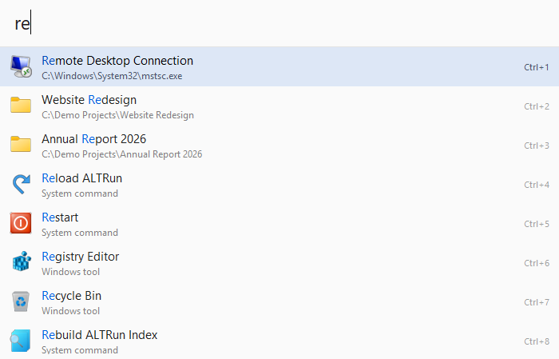 |
| **TokyoNight** | **Dracula** | **CatppuccinMocha** |
| 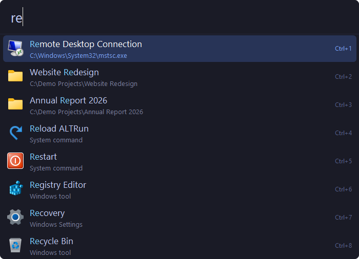 | 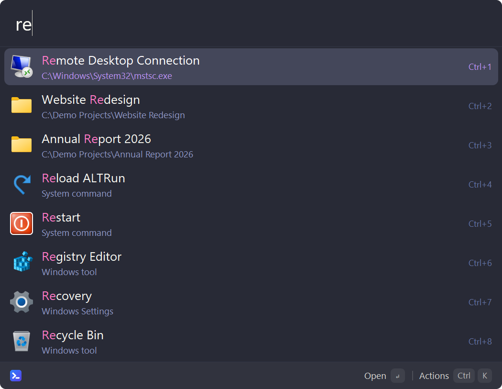 | 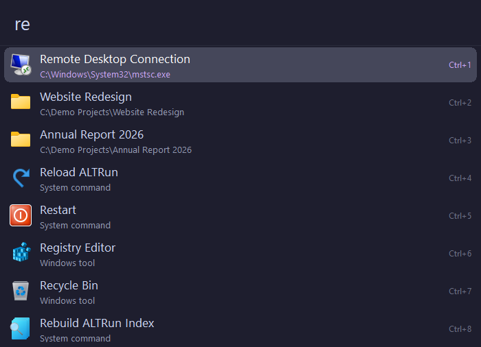 |
| **GruvboxDark** | **SolarizedLight** | **MidnightCompact** |
| 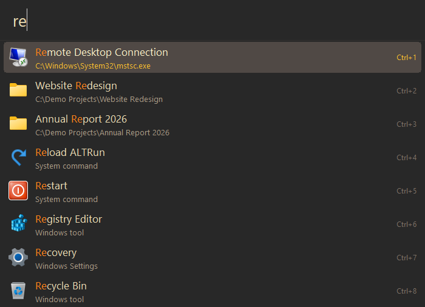 | 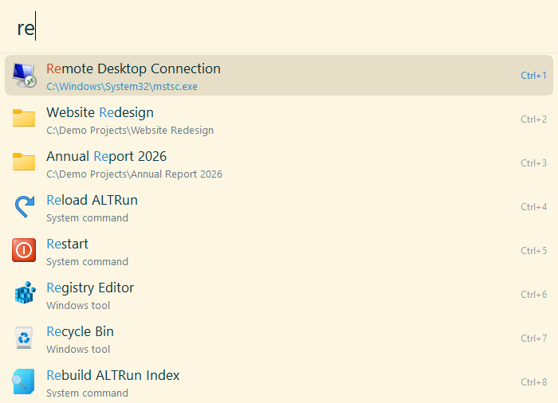 | 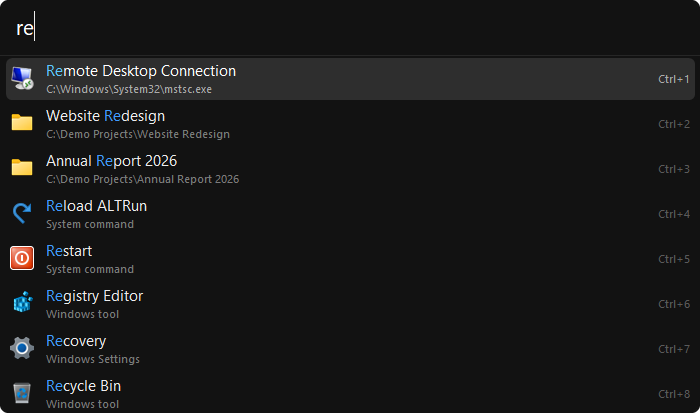 |
| **DarkModern** | **LightModern** | **Monokai** |
| 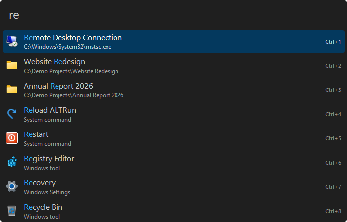 | 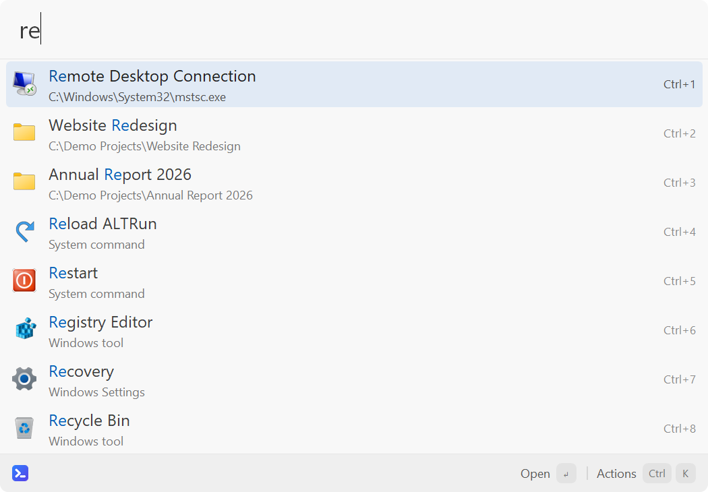 | 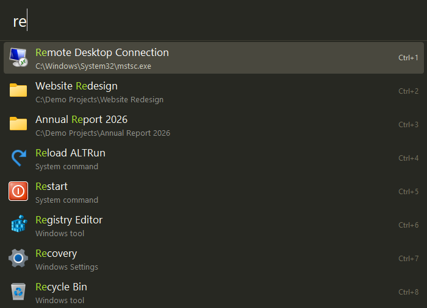 |
| **OneDark** | | |
| 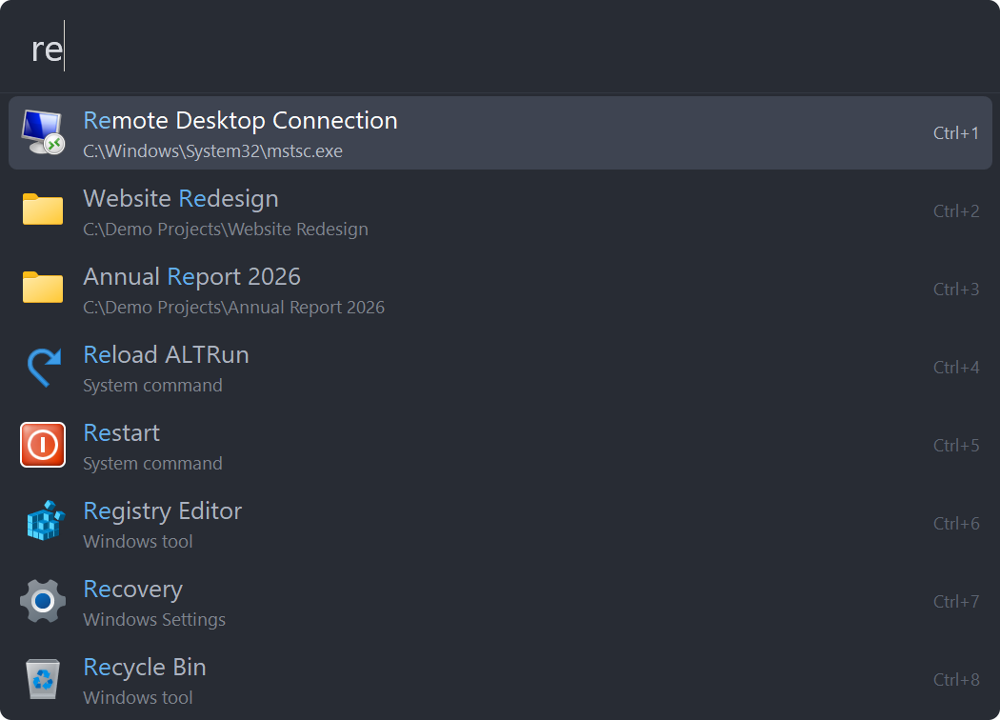 | | |

</details>

截图由 [Tests/Screenshots](Tests/Screenshots/TakeScreenshots.ahk) 在 GitHub Actions 的 Windows 环境中自动生成。


## 快捷键
| 按键 | 功能 |
|---|---|
| `Alt+Space` | 显示 / 隐藏搜索窗口（可在设置中修改） |
| `Enter` | 打开选中项 |
| `Ctrl+Enter` | 文件 / 文件夹：打开所在位置；文字：粘贴到当前窗口 |
| `Alt+Enter` | 复制路径、网址或文字 |
| `Ctrl+1`～`Ctrl+9` | 打开第 N 项 |
| `↑` `↓` `PgUp` `PgDn` `Ctrl+P` `Ctrl+N` | 移动选择 |
| `Ctrl+↑` / `Ctrl+↓` | 上一条 / 下一条搜索记录 |
| `Tab` | 自动补全 |
| `空格`（搜索框为空时） | 进入文件搜索模式；按 `Backspace` 返回 |
| `folder 名称` | 仅搜索文件夹 |
| `?` | 速查表：全部语法和快捷键 |
| `→` / 右键 | 操作面板 / 操作菜单 |
| `F3` | 编辑选中项，或将应用、文件、网址添加为自定义命令 |
| `Ctrl+Del` | 删除选中项（需确认）；应用：从结果中隐藏 |
| `Ctrl+C` / `Ctrl+L` | 复制选中项 / 大字显示 |
| `F2` 或 `Ctrl+,` / `F4` | 偏好设置 / 用记事本编辑 ALTRun.json |
| `F1` | 关于 ALTRun（版本、检查更新、项目主页） |
| `Ctrl+Alt+C` | 剪贴板历史 |
| `Esc` | 关闭操作面板 / 隐藏窗口 |

完整语法（`'文件`、`>命令`、`clip`、`snip`、网页搜索关键字等）见 Wiki：[搜索与快捷键](https://github.com/zhugecaomao/ALTRun/wiki/Usage)。


## 文档
完整文档见 [Wiki](https://github.com/zhugecaomao/ALTRun/wiki)：

| 页面 | 内容 |
|---|---|
| [安装与升级](https://github.com/zhugecaomao/ALTRun/wiki/Installation) | 下载、Scoop / winget、开机启动、自动更新、从 2.x 升级、卸载 |
| [搜索与快捷键](https://github.com/zhugecaomao/ALTRun/wiki/Usage) | 输入语法、快捷键、操作面板、学习排序、使用统计 |
| [自定义命令与片段](https://github.com/zhugecaomao/ALTRun/wiki/Commands-and-Snippets) | 命令类型、路径变量、片段占位符、自动展开 |
| [文件搜索](https://github.com/zhugecaomao/ALTRun/wiki/File-Search) | Everything 联动、内置索引、排除规则 |
| [主题](https://github.com/zhugecaomao/ALTRun/wiki/Themes) | 内置主题、自定义主题、全部可用的键 |
| [扩展功能](https://github.com/zhugecaomao/ALTRun/wiki/Extensions) | 对话框快速跳转、一键加日期、自定义热键、系统命令、PT 工具箱 |
| [设置文件参考](https://github.com/zhugecaomao/ALTRun/wiki/Configuration) | ALTRun.json 各项的含义和默认值 |
| [常见问题](https://github.com/zhugecaomao/ALTRun/wiki/FAQ) | 热键冲突、搜索不到、杀毒软件误报等 |
| [开发指南](https://github.com/zhugecaomao/ALTRun/wiki/Development) | 架构、新增搜索功能、代码规范、测试 |


## 项目结构
```
ALTRun.ahk          入口：列出所有模块并调用 App.Start()
Lib\                通用库（JSON、Logger、Util、TextTools、Kanji、Dialogs、Everything IPC）
Src\Core\           启动流程、设置与迁移、搜索模型、匹配打分、学习排序、操作、文件索引
Src\UI\             搜索窗口、偏好设置、编辑对话框、大字显示、主题、图标缓存
Src\Providers\      搜索功能：应用、自定义命令、片段、剪贴板、系统命令、计算器、网页、书签、文件、终端、速查表
Src\Extensions\     搜索窗口以外的功能：片段自动展开、对话框跳转、加日期、PT 工具箱、检查更新
Resources\          随程序发布的数据（Kanji.txt 简繁对照表、Themes\ 内置主题）
Tests\              单元测试、对照数据（Fixtures）、自动截图（Screenshots）、SPF2M 对照数据工具（Tools\SPF2M）
docs\               Wiki 源文件（docs\wiki，合并后自动发布）、截图（docs\images）
bucket\             Scoop 清单（仓库本身即 Scoop bucket）
packaging\          winget 清单及发布时更新清单的脚本
site\               官网模板和生成脚本（发布到 GitHub Pages）
.github\            GitHub Actions（测试、截图、发布、Wiki、官网、同步到 Gitee）、Issue / PR 模板
```

运行后程序目录下会生成 `Data\`（设置文件 `ALTRun.json`，以及可删除的索引和历史）和 `Themes\`（自定义主题）。


## 开发
```
AutoHotkey64.exe /ErrorStdOut Tests\RunTests.ahk
```
单元测试不依赖界面，退出码为失败数量。新增功能、代码规范和提交流程见 [CONTRIBUTING.md](CONTRIBUTING.md) 和 Wiki 的[开发指南](https://github.com/zhugecaomao/ALTRun/wiki/Development)。


## 贡献与反馈
- 报告问题：[提交 Issue](https://github.com/zhugecaomao/ALTRun/issues/new/choose)（请附上 Windows 版本和复现步骤）
- 建议与讨论：[Discussions](https://github.com/zhugecaomao/ALTRun/discussions)
- 贡献代码：请先阅读 [CONTRIBUTING.md](CONTRIBUTING.md)

如果 ALTRun 对你有帮助，欢迎点亮星标 ⭐


## English
ALTRun is a fast, keyboard-first launcher for Windows, inspired by Alfred for macOS. Press `Alt+Space`, type a few letters, press `Enter`.

- **Tiny**: under 1 MB to download and about 2 MB unpacked — a single `ALTRun.exe` plus a few resource files, with no .NET, Electron or other runtime to install.
- **Search everything**: apps (Start menu, desktop, Microsoft Store), files and folders (via [Everything](https://www.voidtools.com/) or a built-in index), custom commands, snippets, bookmarks and system commands.
- **Smart ranking**: learns which result you pick for each query; matches word initials (`vsc` → Visual Studio Code) and pinyin initials, and highlights the matched characters.
- **All in one**: calculator with unit conversion, web search keywords, clipboard history, snippets with `;keyword` expansion, terminal commands, lock / sleep / shutdown, large type.
- **Keyboard first**: `Alt+Space` or a double tap of `Ctrl` / `Shift`; action panel (`→`), in-place editing (`F3`), `Ctrl+1`–`Ctrl+9`, built-in cheat sheet (`?`).
- **Portable and private**: no installer, no registry, no admin rights, no background service; settings stay in `Data\ALTRun.json`. No telemetry; network access is used only for updates.
- **Automatic updates**: install new versions from the search window (SHA256 verified, settings kept), or use Scoop.
- **Customizable**: English, Simplified / Traditional Chinese and Japanese interface; 20 built-in themes, or follow the Windows light / dark mode.

The screenshots above show the English interface. Documentation is available in the [Wiki](https://github.com/zhugecaomao/ALTRun/wiki) (Chinese). Issues and pull requests in English are welcome.


## 许可证与致谢
[GPL-3.0](LICENSE) © zhugecaomao

感谢 [ALTRun by etworker](https://github.com/etworker/ALTRun)（Delphi）、[RunZ by goreliu](https://github.com/goreliu/runz)（AutoHotkey）和 [Alfred](https://www.alfredapp.com/) 的设计；对话框快速跳转参考了 [Listary](https://www.listary.com/) 的 Quick Switch。
