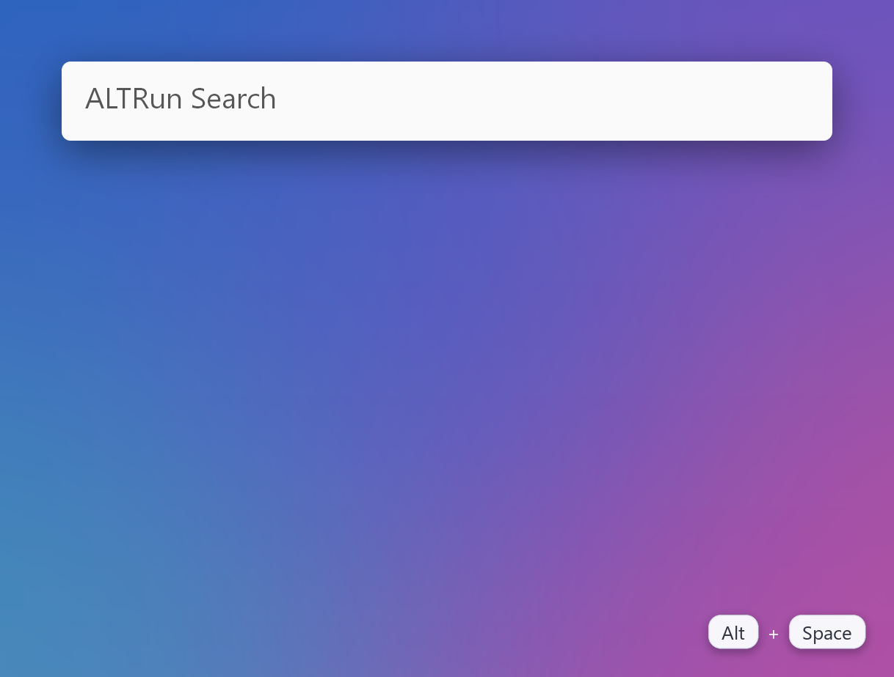
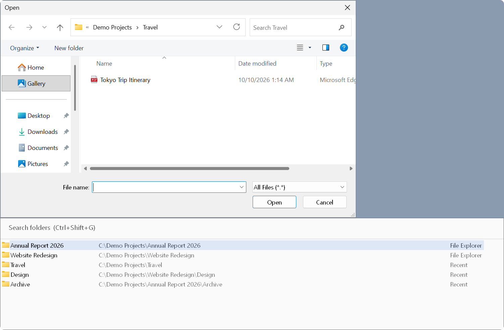
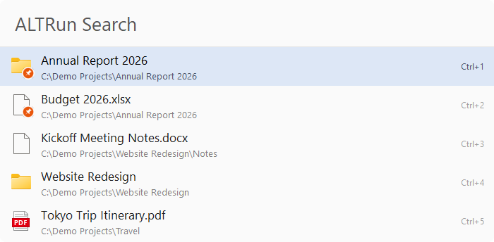
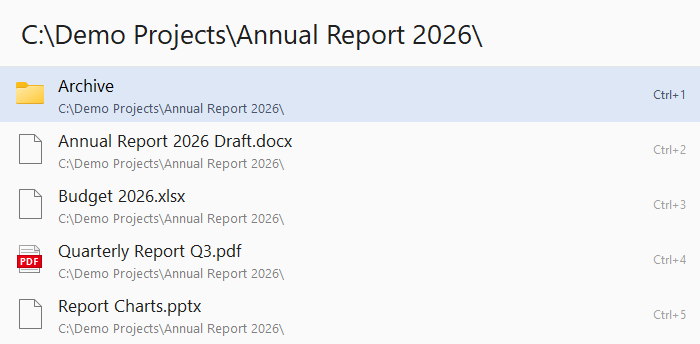
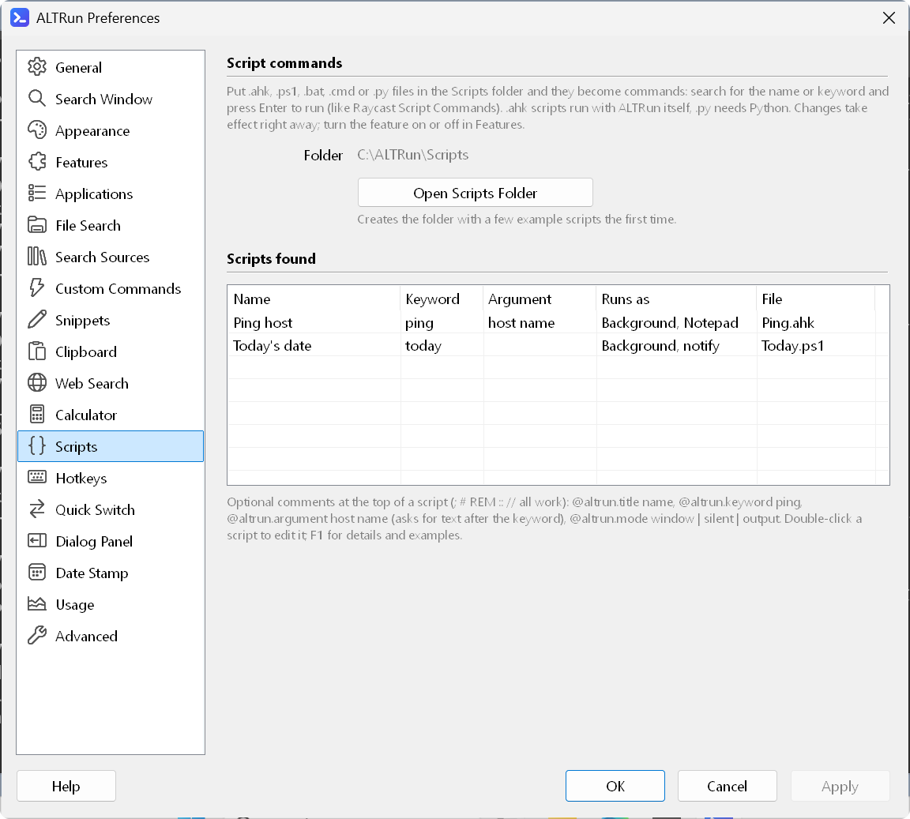
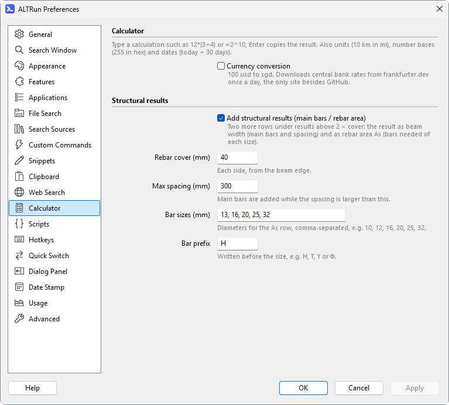

<h1 align="center"> ALTRun</h1>

<p align="center"><b>English</b> | <a href="README.zh-CN.md">简体中文</a></p>

<p align="center">
  <b>A lightweight, open-source launcher for Windows, modeled on <a href="https://www.alfredapp.com/">Alfred</a> for macOS</b><br>
  Press <code>Alt+Space</code>, type a few letters, press <code>Enter</code>: apps, files, web search, calculations, clipboard and system commands, all from one window
</p>

<p align="center">
  <a href="https://github.com/zhugecaomao/ALTRun/releases/latest"></a>
  <a href="https://github.com/zhugecaomao/ALTRun/releases"></a>
  <a href="https://github.com/zhugecaomao/ALTRun/actions/workflows/tests.yml"></a>
  <a href="https://www.autohotkey.com/"></a>
  
  <a href="LICENSE"></a>
</p>

<p align="center">
  <a href="https://zhugecaomao.github.io/ALTRun/">Website</a> ·
  <a href="#why-altrun">Why ALTRun</a> ·
  <a href="#getting-started">Getting started</a> ·
  <a href="#features">Features</a> ·
  <a href="#keyboard-shortcuts">Shortcuts</a> ·
  <a href="https://github.com/zhugecaomao/ALTRun/wiki/en-Home">Documentation (Wiki)</a> ·
  <a href="CHANGELOG.md">Changelog</a>
</p>

<p align="center">
  
</p>


## Why ALTRun
- **Tiny**: under 1 MB to download and about 2 MB unpacked: one `ALTRun.exe` plus a few resource files, with no .NET, Electron or other runtime to install.
- **Fast**: results appear from the first character you type. With [Everything](https://www.voidtools.com/) running, it searches every file on your disks in milliseconds; without it, a built-in index is used.
- **Smart ranking**: learns from what you pick; matches word initials (`vsc` → Visual Studio Code) and pinyin initials (`wx` → 微信), and highlights the matched characters.
- **Beyond launching**: [Quick Switch](#features) jumps an Open / Save dialog to a folder you already have open in Total Commander or Explorer; select text, files or a URL in any program and press `Ctrl+Alt+\` to act on it; type `;keyword` anywhere to expand a snippet.
- **All in one**: calculator and unit conversion, web search, browser bookmarks, clipboard history, text snippets, system commands and a terminal, so you don't need a handful of separate little tools.
- **Keyboard first**: `→` opens the action panel, `F3` edits in place, `Ctrl+1`–`Ctrl+9` open a result directly.
- **Portable and private**: no installer, no registry entries, no admin rights, no background service or driver; all data stays in the `Data\` folder. No telemetry: it only goes online to check for and download updates (plus one exchange-rate download a day if currency conversion is turned on, and a site's icon only when you click "Download Site Icon").
- **Automatic updates**: new versions are announced in the search window; press `Enter` to install (SHA256 verified, settings kept). Scoop is supported too.
- **Customizable**: English, Simplified Chinese, Traditional Chinese and Japanese interface; 20 built-in themes (pick one from thumbnails in Preferences), or follow the Windows light / dark mode; themes and settings are plain JSON files.
- **Free and open source**: GPL-3.0; more than 7,000 tests run automatically on Windows for every pull request.


## Getting started
1. Download the [latest release](https://github.com/zhugecaomao/ALTRun/releases/latest), unzip it to any folder and run `ALTRun.exe` (no installation, no AutoHotkey needed). If Windows SmartScreen says "Windows protected your PC", click **More info** → **Run anyway**; if your antivirus complains, see the [FAQ](https://github.com/zhugecaomao/ALTRun/wiki/en-FAQ#my-antivirus-flags-it).
2. Press `Alt+Space` (or `Alt+R`) to open the search window, type a name and press `Enter`. In Preferences you can switch to a double tap of `Ctrl` / `Shift` instead.
3. Type `?` to see every syntax and shortcut; press `Ctrl+,` to open Preferences.

With [AutoHotkey v2](https://www.autohotkey.com/) installed, you can also run `ALTRun.ahk` from the source code directly.

**Install with [Scoop](https://scoop.sh/)** (creates a Start menu shortcut and keeps your settings across upgrades):
```powershell
scoop bucket add altrun https://github.com/zhugecaomao/ALTRun
scoop install altrun
scoop update altrun    # upgrade (quit ALTRun first)
```
The winget manifest has been submitted; once it is accepted you can install with `winget install zhugecaomao.ALTRun`.

**Upgrading**: when a new version is available, the search window shows "Update Available"; press `Enter` to install it, and your settings are kept. Upgrading from an older version or from 2.x: see [Installation and upgrades](https://github.com/zhugecaomao/ALTRun/wiki/en-Installation).


## Features
**Search**
- **Search window**: results update as you type, with a title and path for each; the window grows with the results, can be dragged and remembers its position, and opens on the screen with the mouse pointer when you have several monitors.
- **Apps**: Start menu, desktop and Microsoft Store apps are indexed automatically; press `Ctrl+Del` to hide apps or built-in commands you don't want, and restore them in Preferences.
- **Match highlighting**: the parts of a title that match what you typed (consecutive characters, word initials, pinyin initials) are highlighted.
- **Files and folders**: in an empty search box, press `Space` first and then type a name (or use `'report` or `open report`). With Everything running it searches all disks, otherwise the built-in index; type a path such as `D:\Projects\` to browse folder by folder.
- **Custom commands**: files, folders, programs (with arguments) and web addresses, each with an optional keyword. Add them from Explorer with right-click → Send to → ALTRun (several at once works too), and check for commands whose path no longer exists.
- **Learned ranking**: remembers which result you picked for each query and moves frequent picks up.
- **Pinned and recent items**: before you type anything, the window lists your pinned items and recently opened ones.
- **Usage statistics**: counts per day and per feature (only counts are recorded).
- **Calculator**: type an expression directly; supports unit conversion (`10 km in mi`), number bases (`255 in hex`), date arithmetic (`today + 30 days`) and optional currency conversion (`100 usd to sgd`).
- **Web search**: `g keywords` (Google), `bd keywords` (Baidu) and more; search engines are customizable, and web search is offered when nothing else matches.
- **Browser bookmarks**: searches Chrome, Edge, Brave and Vivaldi bookmarks; `bm keywords` searches bookmarks only.
- **Window switcher**: type a window title or program name to switch to an open window; `w keywords` searches windows only, `w ` lists them all.
- **System commands**: lock, sleep, shut down, empty the Recycle Bin, volume and media control, Windows tools, more than 40 Windows Settings pages (Display, Bluetooth, Wi-Fi and so on), and text conversions (case, sorting, Simplified / Traditional Chinese and more).

**Productivity**
- **Action panel**: select a result and press `→` (or right-click) to list what you can do with it, such as run as administrator, open file location, copy path, open a terminal here or show properties.
- **Actions on selected content**: select text, files or a URL in any program and press `Ctrl+Alt+\` for actions such as web search, save as a snippet, or convert and replace the original text.
- **Edit in place**: press `F3` to edit a command, snippet or search engine; apps and files can be turned into custom commands in one step.
- **Clipboard history**: press `Ctrl+Alt+C` or type `clip`. Records text, files and images; pin the ones you use often, paste as plain text, and ignore anything copied from password managers.
- **Text snippets**: search by name, keyword or content; placeholders such as `{date}`, `{clipboard}` and `{cursor}`; type `;keyword` in any program to expand a snippet.
- **Terminal**: type `>ipconfig /all` to run it in a terminal.
- **Large type**: press `Ctrl+L` to show a result in full-screen large type, handy for phone numbers or calculation results.

**Extensions**
- **Quick Switch**: in an Open / Save dialog, press `Ctrl+G` to jump to the current Total Commander folder or `Ctrl+E` for the current Explorer folder; a folder panel next to the dialog lists every open and recently used folder.
- **Date stamp**: while renaming a file, press `Ctrl+D` to add or update a date before the extension (`Report.docx` → `Report - 28.09.2026.docx`).
- **Custom hotkeys**: assign a hotkey to any system command, optionally only inside specific programs.
- **Scripts**: put `.ahk`, `.ps1`, `.bat` or `.py` scripts into the `Scripts\` folder and run them from the search window, with an argument, in the background or with their output shown.

**For structural engineers**
- **Structural calculations** (off by default): the calculator can add beam main bars and rebar area below its result.
- **PT Tools**: rebar / BRC mesh area calculations and SPF2M post-tensioning tendon profiles, with results you can copy to Excel.


## Screenshots
| Search window | Quick Switch (folder panel below an Open / Save dialog) |
|:---:|:---:|
|  |  |
| **Action panel (`→`)** | **File search (`Space` + name)** |
|  |  |
| **Calculator** | **Clipboard history (`clip`)** |
|  |  |
| **Pinned and recent items (empty search box)** | **Browse folders (type a path)** |
|  |  |
| **Preferences** | **Custom commands** |
|  |  |
| **Scripts** | **Calculator settings (structural parameters, for engineers)** |
|  |  |

<details>
<summary><b>Built-in themes</b> (20 in total, click to expand)</summary>

| Dark | Classic | Midnight |
|:---:|:---:|:---:|
|  |  |  |
| **Frost** | **Graphite** | **Ocean** |
|  |  |  |
| **Paper** | **DarkCompact** | **LightCompact** |
|  |  |  |
| **TokyoNight** | **Dracula** | **CatppuccinMocha** |
|  |  |  |
| **GruvboxDark** | **SolarizedLight** | **MidnightCompact** |
|  |  |  |
| **DarkModern** | **LightModern** | **Monokai** |
|  |  |  |
| **OneDark** | | |
|  | | |

</details>

The screenshots are generated automatically by [Tests/Screenshots](Tests/Screenshots/TakeScreenshots.ahk) on a Windows runner in GitHub Actions.


## Keyboard shortcuts
| Key | Action |
|---|---|
| `Alt+Space` | Show / hide the search window (configurable) |
| `Enter` | Open the selected result |
| `Ctrl+Enter` | Files / folders: open the containing folder; text: paste into the active window |
| `Alt+Enter` | Copy the path, URL or text |
| `Ctrl+1`–`Ctrl+9` | Open the Nth result |
| `↑` `↓` / `Ctrl+P` `Ctrl+N` | Move up / down one row |
| `PgUp` `PgDn` | Previous / next page |
| `Ctrl+↑` / `Ctrl+↓` | Previous / next search from history |
| `Tab` | Autocomplete; folders: browse into them |
| `Insert` | Mark several files / folders, then press `→` to act on all of them |
| `Space` (in an empty search box, or with the cursor at the start) | Switch to file search, keeping what you typed; `Backspace` in an empty box or at the start switches back |
| `folder name` | Search folders only |
| `?` | Cheat sheet: every syntax and shortcut |
| `→` / right-click | Action panel / action menu |
| `F3` | Edit the selected result, or add an app, file or URL as a custom command |
| `Ctrl+Del` | Delete the selected result (with confirmation); apps: hide from results |
| `Ctrl+C` / `Ctrl+L` | Copy the selected result / large type |
| `F2` or `Ctrl+,` / `F4` | Preferences / edit ALTRun.json in Notepad |
| `F1` | About ALTRun (version, check for updates, project page) |
| `Ctrl+Alt+C` | Clipboard history |
| `Esc` | Close the action panel / hide the window |

For the full syntax (`'file`, `>command`, `clip`, `snip`, web search keywords and more), see [Search and shortcuts](https://github.com/zhugecaomao/ALTRun/wiki/en-Usage) in the wiki.


## Documentation
The full documentation is in the [wiki](https://github.com/zhugecaomao/ALTRun/wiki/en-Home):

| Page | Contents |
|---|---|
| [Installation and upgrades](https://github.com/zhugecaomao/ALTRun/wiki/en-Installation) | Download, Scoop / winget, start with Windows, automatic updates, upgrading from 2.x, uninstalling |
| [Search and shortcuts](https://github.com/zhugecaomao/ALTRun/wiki/en-Usage) | Search syntax, shortcuts, action panel, learned ranking, usage statistics |
| [Custom commands and snippets](https://github.com/zhugecaomao/ALTRun/wiki/en-Commands-and-Snippets) | Command types, path variables, snippet placeholders, snippet expansion |
| [File search](https://github.com/zhugecaomao/ALTRun/wiki/en-File-Search) | Everything integration, built-in index, exclusion rules |
| [Themes](https://github.com/zhugecaomao/ALTRun/wiki/en-Themes) | Built-in themes, custom themes, every available key |
| [Extensions](https://github.com/zhugecaomao/ALTRun/wiki/en-Extensions) | Quick Switch, date stamp, custom hotkeys, system commands, PT Tools |
| [Settings reference](https://github.com/zhugecaomao/ALTRun/wiki/en-Configuration) | Every ALTRun.json setting and its default value |
| [FAQ](https://github.com/zhugecaomao/ALTRun/wiki/en-FAQ) | Hotkey conflicts, things that can't be found, antivirus false positives and more |
| [Development guide](https://github.com/zhugecaomao/ALTRun/wiki/en-Development) | Architecture, adding a search feature, code style, tests |


## Feedback and contributing
- Report a problem: [open an issue](https://github.com/zhugecaomao/ALTRun/issues/new/choose) (please include your Windows version and the steps to reproduce)
- Ideas and discussion: [Discussions](https://github.com/zhugecaomao/ALTRun/discussions)
- Code contributions: please read [CONTRIBUTING.md](CONTRIBUTING.md) first; the [Development guide](https://github.com/zhugecaomao/ALTRun/wiki/en-Development) covers the project structure, running the tests and adding a search feature

Issues and pull requests are welcome in English or Chinese. If ALTRun is useful to you, a star ⭐ is much appreciated.


## Code signing policy
Free code signing provided by [SignPath.io](https://about.signpath.io/), certificate by [SignPath Foundation](https://signpath.org/).

- Only `ALTRun.exe` built from this repository's source by the [Release workflow](.github/workflows/release.yml) is signed.
- Committers and reviewers: [zhugecaomao](https://github.com/zhugecaomao)
- Approvers: [zhugecaomao](https://github.com/zhugecaomao)
- Privacy policy: [SECURITY.md](SECURITY.md#privacy-policy)


## License and credits
ALTRun is open source under the [GPL-3.0](LICENSE) license © zhugecaomao

Thanks to these projects for the inspiration:
- [ALTRun](https://github.com/etworker/ALTRun) (etworker, Delphi): the name and the original design
- [RunZ](https://github.com/goreliu/runz) (goreliu, AutoHotkey): the idea of writing a launcher in AutoHotkey
- [Alfred](https://www.alfredapp.com/): the interaction model
- [Listary](https://www.listary.com/): its Quick Switch is the model for ALTRun's
