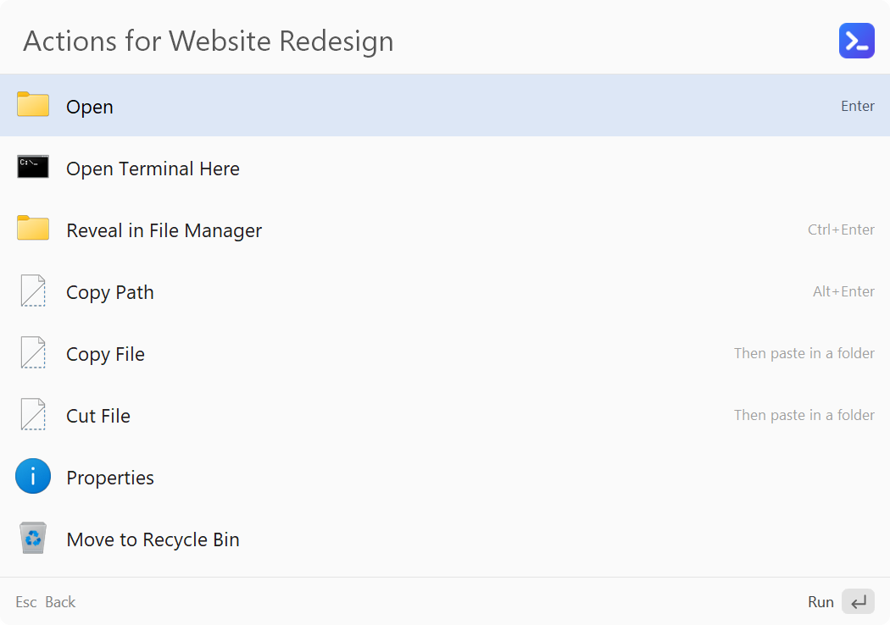
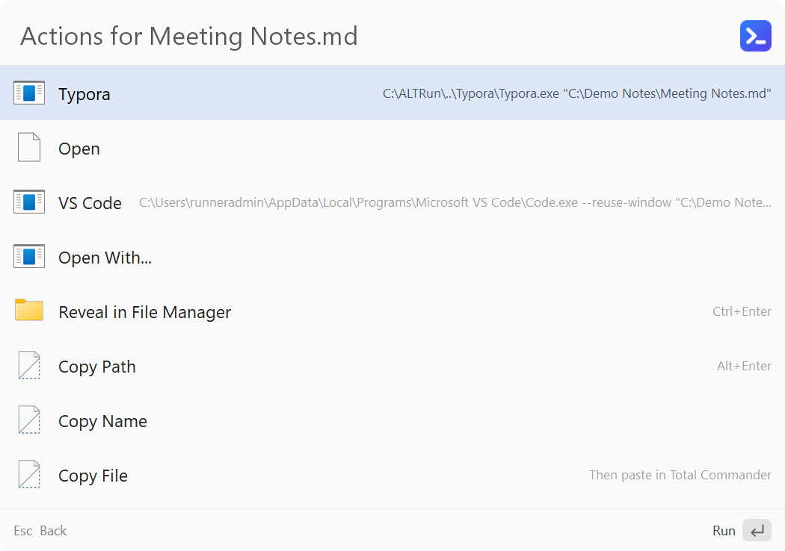
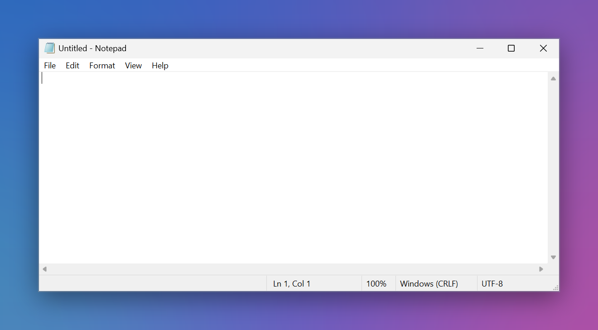
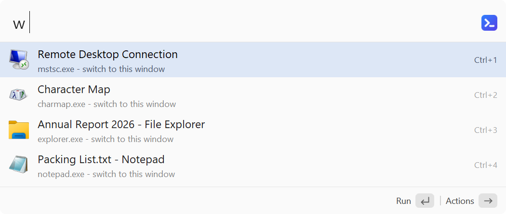

<h1 align="center"> ALTRun</h1>

<p align="center"><b>English</b> | <a href="README.zh-CN.md">简体中文</a></p>

<p align="center">
  <b>A lightweight, open-source launcher for Windows, modeled on <a href="https://www.alfredapp.com/">Alfred</a> for macOS</b><br>
  Press <code>Alt+Space</code>, type a few letters, press <code>Enter</code>: apps, files, web search, calculations, clipboard and system commands, all from one window
</p>

<p align="center">
  <a href="https://github.com/zhugecaomao/ALTRun/releases/latest"></a>
  <a href="https://github.com/zhugecaomao/ALTRun/releases"></a>
  <a href="https://github.com/zhugecaomao/ALTRun/actions/workflows/tests.yml"></a>
  <a href="https://www.autohotkey.com/"></a>
  
  <a href="LICENSE"></a>
</p>

<p align="center">
  <a href="https://zhugecaomao.github.io/ALTRun/">Website</a> ·
  <a href="#why-altrun">Why ALTRun</a> ·
  <a href="#highlights">Highlights</a> ·
  <a href="#getting-started">Getting started</a> ·
  <a href="https://github.com/zhugecaomao/ALTRun/wiki/Home">Documentation (Wiki)</a> ·
  <a href="CHANGELOG.md">Changelog</a>
</p>

<p align="center">
  
</p>


## Why ALTRun
- **Tiny**: about 2.5 MB, one `ALTRun.exe` and a few resource files; no .NET, Electron or other runtime to install.
- **Fast**: results appear as you type; with [Everything](https://www.voidtools.com/) running, file searches cover all disks in milliseconds.
- **Smart**: learns which result you pick for what you type; matches word initials (`vsc` → Visual Studio Code) and pinyin initials (`wx` → 微信).
- **Keyboard-first**: `→` for actions, `F3` to edit in place, `Ctrl+1`–`Ctrl+9` to open a result, `?` for every shortcut.
- **Portable and private**: no installer, registry entries, admin rights or background service; your data stays on your PC, with no telemetry.
- **Always up to date**: a new version shows up in the search window and installs with `Enter`, checked against its SHA256 and keeping your settings; winget and Scoop work too.
- **Free and open source**: GPL-3.0, with thousands of automated tests run on Windows for every change.


## Highlights
<table>
<tr>
<td width="50%" align="center"><b>Search everything</b>: apps, files, custom commands, windows and system commands in one box, as you type (<a href="https://github.com/zhugecaomao/ALTRun/wiki/Usage">more</a>)</td>
<td width="50%" align="center"><b>Action panel</b>: press <code>→</code> to run as administrator, open the containing folder, copy the path, open a terminal there... (<a href="https://github.com/zhugecaomao/ALTRun/wiki/Usage#action-panel">more</a>)</td>
</tr>
<tr>
<td width="50%"></td>
<td width="50%"></td>
</tr>
<tr>
<td width="50%" align="center"><b>Quick Switch</b>: jump any Open / Save dialog to a folder open in File Explorer, Total Commander, Directory Opus or Arke (<a href="https://github.com/zhugecaomao/ALTRun/wiki/Quick-Switch">more</a>)</td>
<td width="50%" align="center"><b>Actions on selected content</b>: select text, files or a URL in any program and press <code>Ctrl+Alt+\</code>; the commands you set for that kind of content come first (<a href="https://github.com/zhugecaomao/ALTRun/wiki/Content-Types">more</a>)</td>
</tr>
<tr>
<td width="50%"></td>
<td width="50%"></td>
</tr>
<tr>
<td width="50%" align="center"><b>Clipboard history</b>: <code>Ctrl+Alt+C</code> brings back copied text, files and images; filter and paste (<a href="https://github.com/zhugecaomao/ALTRun/wiki/Clipboard">more</a>)</td>
<td width="50%" align="center"><b>Snippets</b>: type <code>;thx</code> in any program to expand a reply, a signature or an address (<a href="https://github.com/zhugecaomao/ALTRun/wiki/Snippets">more</a>)</td>
</tr>
<tr>
<td width="50%"></td>
<td width="50%"></td>
</tr>
<tr>
<td width="50%" align="center"><b>Calculator</b>: <code>12*(3+4)</code>, <code>10 km in mi</code>, <code>255 in hex</code>, <code>today + 30 days</code>, <code>100 usd to sgd</code>, as you type (<a href="https://github.com/zhugecaomao/ALTRun/wiki/Calculator">more</a>)</td>
<td width="50%" align="center"><b>File search</b>: <code>Space</code> + a name searches every disk with Everything running, or the built-in index otherwise (<a href="https://github.com/zhugecaomao/ALTRun/wiki/File-Search">more</a>)</td>
</tr>
<tr>
<td width="50%"></td>
<td width="50%"></td>
</tr>
<tr>
<td width="50%" align="center"><b>Browse folders</b>: type a path; <code>Tab</code> goes in, <code>Backspace</code> goes up (<a href="https://github.com/zhugecaomao/ALTRun/wiki/File-Search#browsing-folders">more</a>)</td>
<td width="50%" align="center"><b>Pinyin initials</b>: <code>jsb</code> finds 记事本 (Notepad), and file names work too (<a href="https://github.com/zhugecaomao/ALTRun/wiki/Usage#how-matching-works">more</a>)</td>
</tr>
<tr>
<td width="50%"></td>
<td width="50%"></td>
</tr>
<tr>
<td width="50%" align="center"><b>Web search</b>: <code>g keywords</code>, <code>bd keywords</code> or your own engines; one keyword can open several sites (<a href="https://github.com/zhugecaomao/ALTRun/wiki/Web-Search">more</a>)</td>
<td width="50%" align="center"><b>Window switching</b>: <code>w</code> + a title or program name switches to an open window (<a href="https://github.com/zhugecaomao/ALTRun/wiki/Window-Switching">more</a>)</td>
</tr>
<tr>
<td width="50%"></td>
<td width="50%"></td>
</tr>
<tr>
<td width="50%" align="center"><b>Scripts</b>: <code>.ahk</code>, <code>.ps1</code> and <code>.py</code> scripts become commands, and can show live results while you type (<a href="https://github.com/zhugecaomao/ALTRun/wiki/Scripts#live-results">more</a>)</td>
<td width="50%" align="center"><b>Themes</b>: 22 built-in themes in three densities, optionally following the Windows light / dark mode (<a href="https://github.com/zhugecaomao/ALTRun/wiki/Themes">more</a>)</td>
</tr>
<tr>
<td width="50%"></td>
<td width="50%"></td>
</tr>
</table>

The screenshots are made automatically by [Tests/Screenshots](Tests/Screenshots/TakeScreenshots.ahk) on a Windows runner in GitHub Actions.


## More features
- **Search**: browser bookmarks and history, recent files, pinned and recent items, system commands and 40+ Windows Settings pages, a terminal (`>ipconfig`), large type
- **Customize**: custom commands with arguments, content types, custom hotkeys, Send to ALTRun from Explorer, a [script library](https://zhugecaomao.github.io/ALTRun/#scripts)
- **Tools**: date stamp while renaming (`Ctrl+D`), folder sync with robocopy, delayed start, Caps Lock to switch the input method, PT Tools for structural engineers
- **Interface**: English, Simplified Chinese, Traditional Chinese and Japanese

Every feature, with screenshots: [Features](https://github.com/zhugecaomao/ALTRun/wiki/Features).


## Getting started
1. [Download the latest release](https://github.com/zhugecaomao/ALTRun/releases/latest), unzip it to any folder and run `ALTRun.exe` (no installation or AutoHotkey needed). Or install it with a package manager:
   ```powershell
   winget install zhugecaomao.ALTRun
   # or
   scoop bucket add altrun https://github.com/zhugecaomao/ALTRun
   scoop install altrun
   ```
2. Press `Alt+Space` (or `Alt+R`), type a few letters and press `Enter`.
3. Type `?` for every search syntax and shortcut; press `Ctrl+,` for Preferences.

If Windows SmartScreen blocks it, choose **More info** → **Run anyway**; for antivirus warnings, see the [FAQ](https://github.com/zhugecaomao/ALTRun/wiki/FAQ#my-antivirus-flags-it). Upgrading, running from source with AutoHotkey v2 and uninstalling: [Installation and upgrades](https://github.com/zhugecaomao/ALTRun/wiki/Installation).

| To do this | Type |
|---|---|
| Open a program | `word` → `Enter` |
| Find a file or folder | `Space`, then `report` |
| Calculate | `12*(3+4)`; `Enter` copies the result |
| Search the web | `g keywords` |
| Paste from the clipboard history | `Ctrl+Alt+C` |
| Run a command in a terminal | `>ipconfig /all` |
| See what you can do with a result | `→` or right-click |
| Edit the selected command | `F3` |

Every shortcut: [Search and shortcuts](https://github.com/zhugecaomao/ALTRun/wiki/Usage#shortcuts).


## Documentation
The [Wiki](https://github.com/zhugecaomao/ALTRun/wiki/Home) covers every feature in detail, with examples. Good places to start:
[Features](https://github.com/zhugecaomao/ALTRun/wiki/Features) ·
[Getting started](https://github.com/zhugecaomao/ALTRun/wiki/Getting-Started) ·
[Search and shortcuts](https://github.com/zhugecaomao/ALTRun/wiki/Usage) ·
[Custom commands](https://github.com/zhugecaomao/ALTRun/wiki/Custom-Commands) ·
[Snippets](https://github.com/zhugecaomao/ALTRun/wiki/Snippets) ·
[Quick Switch](https://github.com/zhugecaomao/ALTRun/wiki/Quick-Switch) ·
[Scripts](https://github.com/zhugecaomao/ALTRun/wiki/Scripts) ·
[Settings reference](https://github.com/zhugecaomao/ALTRun/wiki/Configuration) ·
[FAQ](https://github.com/zhugecaomao/ALTRun/wiki/FAQ)


## Feedback and contributing
- [Report a bug](https://github.com/zhugecaomao/ALTRun/issues/new?template=bug_report.yml) (with your Windows version and the steps to reproduce), [suggest a feature](https://github.com/zhugecaomao/ALTRun/issues/new?template=feature_request.yml) or [start a discussion](https://github.com/zhugecaomao/ALTRun/issues/new?template=discussion.yml), in English or Chinese
- Code: read [CONTRIBUTING.md](CONTRIBUTING.md) first; the [Development guide](https://github.com/zhugecaomao/ALTRun/wiki/Development) covers the project structure, the tests and adding a search feature
- Scripts: contribute one to the [script library](docs/scripts/README.md#contributing-a-script--投稿脚本) with a pull request

If ALTRun is useful to you, a star ⭐ is much appreciated.


## Code signing policy
Free code signing provided by [SignPath.io](https://about.signpath.io/), certificate by [SignPath Foundation](https://signpath.org/).

- Only `ALTRun.exe` built from this repository's source by the [Release workflow](.github/workflows/release.yml) is signed.
- Committers and reviewers: [zhugecaomao](https://github.com/zhugecaomao)
- Approvers: [zhugecaomao](https://github.com/zhugecaomao)
- Privacy policy: [SECURITY.md](SECURITY.md#privacy-policy)


## License and credits
ALTRun is open source under the [GPL-3.0](LICENSE) license © zhugecaomao

Thanks to these projects:
- [ALTRun](https://github.com/etworker/ALTRun) (etworker, Delphi): the name and the original design
- [RunZ](https://github.com/goreliu/runz) (goreliu, AutoHotkey): the idea of writing a launcher in AutoHotkey
- [Alfred](https://www.alfredapp.com/): the interaction model
- [Listary](https://www.listary.com/): its Quick Switch is the model for ALTRun's
- [pypinyin](https://github.com/mozillazg/python-pinyin) (Copyright (c) 2016 mozillazg, 闲耘; [MIT](https://github.com/mozillazg/python-pinyin/blob/master/LICENSE.txt)): pinyin initials of rare and Traditional characters
