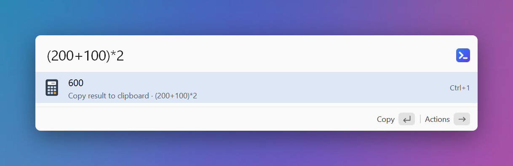

<h1 align="center"> ALTRun</h1>

<p align="center"><a href="README.md">English</a> | <b>简体中文</b></p>

<p align="center">
  <b>轻量、开源的 Windows 启动器, 操作方式参照 macOS 上的 <a href="https://www.alfredapp.com/">Alfred</a></b><br>
  按 <code>Alt+Space</code>, 输入几个字母, 按 <code>Enter</code>: 程序、文件、网页、计算、剪贴板、系统命令, 一个窗口完成
</p>

<p align="center">
  <a href="https://github.com/zhugecaomao/ALTRun/releases/latest"></a>
  <a href="https://github.com/zhugecaomao/ALTRun/releases"></a>
  <a href="https://github.com/zhugecaomao/ALTRun/actions/workflows/tests.yml"></a>
  <a href="https://www.autohotkey.com/"></a>
  
  <a href="LICENSE"></a>
</p>

<p align="center">
  <a href="https://zhugecaomao.github.io/ALTRun/">官网</a> ·
  <a href="#功能">功能</a> ·
  <a href="#快速开始">快速开始</a> ·
  <a href="https://github.com/zhugecaomao/ALTRun/wiki">使用文档 (Wiki)</a> ·
  <a href="CHANGELOG.md">更新日志</a>
</p>

<p align="center">
  
</p>


## 功能
- **输入即搜**: 程序 (开始菜单、桌面、Microsoft Store 应用)、自定义命令、打开的窗口、系统命令在同一个列表里; 支持单词首字母 (`vsc` → Visual Studio Code) 和拼音首字母 (`wx` → 微信), 并按你的选择调整排序。[详情](https://github.com/zhugecaomao/ALTRun/wiki/Usage-zh)
- **文件和文件夹**: `空格` + 名称; 开着 [Everything](https://www.voidtools.com/) 时毫秒级搜索全盘, 否则用内置索引; 输入路径可以一层层浏览文件夹。[详情](https://github.com/zhugecaomao/ALTRun/wiki/File-Search-zh)
- **不只是启动**: 按 `→` 列出对结果能做的操作 (用管理员身份运行、打开所在文件夹、复制路径、在这里打开终端...); `Ctrl+Alt+\` 对任意程序里选中的文字、文件或网址做同样的事。[详情](https://github.com/zhugecaomao/ALTRun/wiki/Usage-zh#操作面板)
- **计算器**: `12*(3+4)`、`10 km in mi`、`255 in hex`、`today + 30 days`、`100 usd to cny`, 可选计算历史。[详情](https://github.com/zhugecaomao/ALTRun/wiki/Calculator-zh)
- **网页搜索和书签**: `g 关键词`、`bd 关键词` 或你自己的搜索引擎; 搜索 Chrome、Edge、Brave、Vivaldi 的书签和历史记录。[详情](https://github.com/zhugecaomao/ALTRun/wiki/Web-Search-zh)
- **剪贴板历史和文字片段**: `Ctrl+Alt+C` 找回复制过的文字、文件和图片; 在任意程序里输入 `;关键字` 展开片段。[详情](https://github.com/zhugecaomao/ALTRun/wiki/Clipboard-zh)
- **对话框快速跳转 (Quick Switch)**: 打开 / 保存对话框里按 `Ctrl+G`, 或点对话框旁边的文件夹面板, 跳到资源管理器、Total Commander、Directory Opus 或 Arke 里打开的文件夹。[详情](https://github.com/zhugecaomao/ALTRun/wiki/Quick-Switch-zh)
- **按自己的需要扩展**: 带参数 (`{query}`) 的自定义命令、自定义热键, 以及能实时显示结果的 `.ahk` / `.ps1` / `.py` / `.bat` 脚本, [脚本库](https://zhugecaomao.github.io/ALTRun/#scripts) 里有现成的。[详情](https://github.com/zhugecaomao/ALTRun/wiki/Scripts-zh)
- **小巧、便携、注重隐私**: 约 2.5 MB, 免安装、不写注册表、不需要管理员权限、没有后台服务; 数据留在你的电脑上, 不收集遥测数据。[详情](https://github.com/zhugecaomao/ALTRun/wiki/Privacy-zh)
- **可定制, 随时更新**: 简体中文、繁體中文、English、日本語界面; 22 套 [主题](https://github.com/zhugecaomao/ALTRun/wiki/Themes-zh), 可跟随 Windows 浅色 / 深色模式; 一键更新并保留设置。


## 快速开始
1. [下载最新版本](https://github.com/zhugecaomao/ALTRun/releases/latest), 解压到任意文件夹, 运行 `ALTRun.exe` (不用安装, 也不需要 AutoHotkey)。也可以用包管理器安装:
   ```powershell
   winget install zhugecaomao.ALTRun
   # 或者
   scoop bucket add altrun https://github.com/zhugecaomao/ALTRun
   scoop install altrun
   ```
2. 按 `Alt+Space` (或 `Alt+R`), 输入几个字母, 按 `Enter`。
3. 输入 `?` 查看全部搜索语法和快捷键; 按 `Ctrl+,` 打开偏好设置。

如果 Windows SmartScreen 拦截, 点 **更多信息** → **仍要运行**; 杀毒软件误报见 [常见问题](https://github.com/zhugecaomao/ALTRun/wiki/FAQ-zh#杀毒软件报毒)。升级、用 AutoHotkey v2 运行源码、卸载: 见 [安装与升级](https://github.com/zhugecaomao/ALTRun/wiki/Installation-zh)。

| 要做的事 | 输入 |
|---|---|
| 打开程序 | `word` → `Enter` |
| 找文件或文件夹 | `空格`, 然后 `report` |
| 计算 | `12*(3+4)`; `Enter` 复制结果 |
| 搜索网页 | `g 关键词` |
| 从剪贴板历史粘贴 | `Ctrl+Alt+C` |
| 在终端里运行命令 | `>ipconfig /all` |
| 看对结果能做什么 | `→` 或右键 |
| 编辑选中的命令 | `F3` |

全部快捷键: [搜索与快捷键](https://github.com/zhugecaomao/ALTRun/wiki/Usage-zh#快捷键)。


## 截图
| 搜索窗口 | 操作面板 (`→`) |
|:---:|:---:|
|  |  |
| **文件搜索 (`空格` + 名称)** | **计算和单位换算** |
|  |  |
| **剪贴板历史 (`Ctrl+Alt+C`)** | **打开 / 保存对话框里的快速跳转** |
|  |  |

Wiki 每一页都有对应功能的截图, [主题](https://github.com/zhugecaomao/ALTRun/wiki/Themes-zh) 页有全部 22 套主题。截图由 [Tests/Screenshots](Tests/Screenshots/TakeScreenshots.ahk) 在 GitHub Actions 的 Windows 机器上自动生成。


## 文档
[Wiki](https://github.com/zhugecaomao/ALTRun/wiki/Home-zh) 详细介绍每个功能, 附示例。可以从这几页开始:
[5 分钟上手](https://github.com/zhugecaomao/ALTRun/wiki/Getting-Started-zh) ·
[搜索与快捷键](https://github.com/zhugecaomao/ALTRun/wiki/Usage-zh) ·
[自定义命令](https://github.com/zhugecaomao/ALTRun/wiki/Custom-Commands-zh) ·
[文字片段](https://github.com/zhugecaomao/ALTRun/wiki/Snippets-zh) ·
[对话框快速跳转](https://github.com/zhugecaomao/ALTRun/wiki/Quick-Switch-zh) ·
[脚本扩展](https://github.com/zhugecaomao/ALTRun/wiki/Scripts-zh) ·
[设置文件参考](https://github.com/zhugecaomao/ALTRun/wiki/Configuration-zh) ·
[常见问题](https://github.com/zhugecaomao/ALTRun/wiki/FAQ-zh)


## 反馈与参与
- [报告问题](https://github.com/zhugecaomao/ALTRun/issues/new?template=bug_report.yml) (请写上 Windows 版本和重现步骤)、[功能建议](https://github.com/zhugecaomao/ALTRun/issues/new?template=feature_request.yml) 或 [发起讨论](https://github.com/zhugecaomao/ALTRun/issues/new?template=discussion.yml), 中文、英文都可以
- 代码: 先读 [CONTRIBUTING.md](CONTRIBUTING.md#参与贡献); [开发指南](https://github.com/zhugecaomao/ALTRun/wiki/Development-zh) 介绍项目结构、测试和如何添加搜索功能
- 脚本: 通过 Pull Request 投稿到 [脚本库](docs/scripts/README.md#contributing-a-script--投稿脚本)

如果 ALTRun 对你有帮助, 欢迎点个 Star ⭐


## Code signing policy
Free code signing provided by [SignPath.io](https://about.signpath.io/), certificate by [SignPath Foundation](https://signpath.org/).

- Only `ALTRun.exe` built from this repository's source by the [Release workflow](.github/workflows/release.yml) is signed.
- Committers and reviewers: [zhugecaomao](https://github.com/zhugecaomao)
- Approvers: [zhugecaomao](https://github.com/zhugecaomao)
- Privacy policy: [SECURITY.md](SECURITY.md#privacy-policy) (中文: [隐私说明](SECURITY.md#隐私说明))


## 许可证与致谢
ALTRun 以 [GPL-3.0](LICENSE) 许可开源 © zhugecaomao

感谢这些项目:
- [ALTRun](https://github.com/etworker/ALTRun) (etworker, Delphi): 名字和最初的设计
- [RunZ](https://github.com/goreliu/runz) (goreliu, AutoHotkey): 用 AutoHotkey 写启动器的思路
- [Alfred](https://www.alfredapp.com/): 操作方式
- [Listary](https://www.listary.com/): 对话框快速跳转参考了它的 Quick Switch
- [pypinyin](https://github.com/mozillazg/python-pinyin) (Copyright (c) 2016 mozillazg, 闲耘; [MIT](https://github.com/mozillazg/python-pinyin/blob/master/LICENSE.txt)): 生僻字和繁体字的拼音首字母
